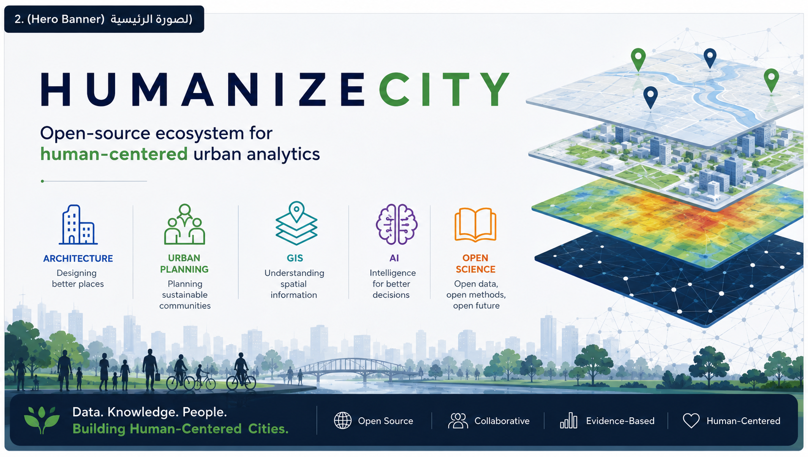
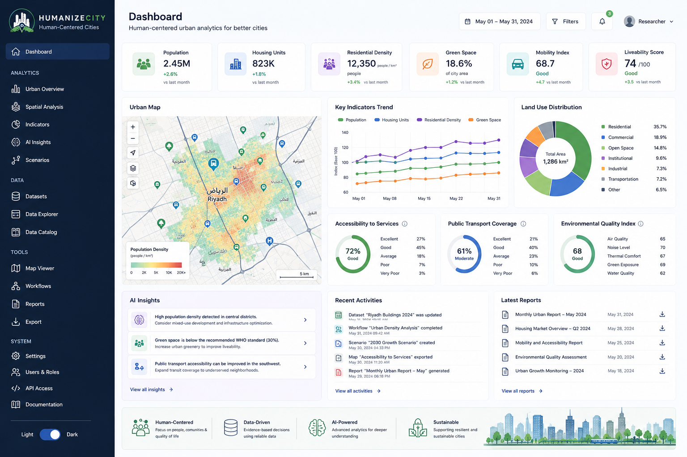
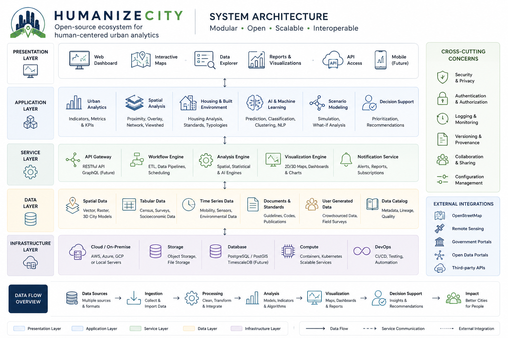
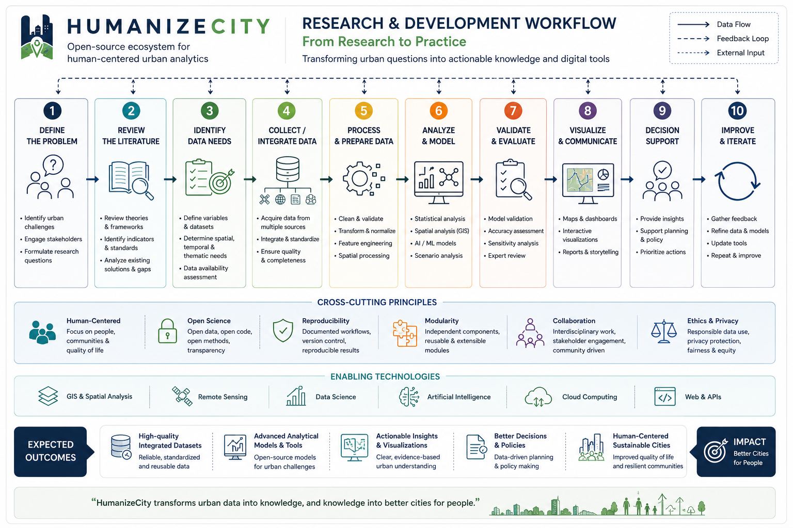

<p align="center">
  
</p>

<h1 align="center">🏙 HumanizeCity</h1>

<p align="center">
<strong>An Open-Source Ecosystem for Human-Centered Urban Analytics, Research, and AI-Assisted Planning.</strong>
</p>

<p align="center">


</p>

---

# Overview

HumanizeCity is an open-source ecosystem that integrates architecture, urban planning, geographic information systems (GIS), data science, and artificial intelligence to support evidence-based, human-centered urban development.

Rather than being a single software application, HumanizeCity provides a growing collection of interoperable tools, datasets, methodologies, and research resources designed to bridge the gap between academic research and real-world urban practice.

---

# Why HumanizeCity?

Urban research has never produced more knowledge, yet much of that knowledge remains difficult to translate into practical planning tools.

HumanizeCity aims to change this by transforming research outputs into reusable open-source software, enabling researchers, planners, architects, public agencies, and educators to build upon shared knowledge rather than isolated projects.

---

# Key Features

- 🏙 Human-centered urban analytics
- 🗺 GIS and spatial analysis
- 🤖 AI-assisted planning
- 📊 Interactive dashboards
- 🌍 Open urban datasets
- 📚 Reproducible research workflows
- 🧩 Modular architecture
- 🎓 Educational and research resources

---

# Dashboard Preview

<p align="center">

</p>

---

# Quick Start

```bash
git clone https://github.com/saeedburgawi/HumanizeCity.git

cd HumanizeCity

npm install

npm run dev
```

---

# Documentation

| Document | Description |
|----------|-------------|
| 📖 [Getting Started](docs/getting-started.md) | First steps |
| 🎯 [Vision](docs/vision.md) | Long-term vision |
| 🏛 [Architecture](docs/architecture.md) | System architecture |
| 🔬 [Methodology](docs/methodology.md) | Research methodology |
| 🗂 [Datasets](docs/datasets.md) | Urban datasets |
| ⚙️ [Installation](docs/installation.md) | Installation guide |
| 🛣 [Roadmap](docs/roadmap.md) | Future development |
| 📚 [Publications](docs/publications.md) | Research publications |
| ❓ [FAQ](docs/faq.md) | Frequently asked questions |

---

<details>

<summary><b>🔄 From Research to Practice</b></summary>

HumanizeCity is founded on a simple principle:

> Research should not end with publication.

The project transforms methodologies, indicators, planning frameworks, design standards, and analytical models into reusable open-source software that supports evidence-based urban decision-making.

</details>

---

<details>

<summary><b>🏛 System Architecture</b></summary>

<p align="center">



</p>

The platform follows a modular architecture that integrates architecture, GIS, urban analytics, AI, and data science into a reproducible research workflow.

</details>

---

<details>

<summary><b>🔄 Project Workflow</b></summary>

<p align="center">



</p>

The HumanizeCity workflow follows an evidence-based process:

Urban Challenge

↓

Research

↓

Data Collection

↓

Urban Analytics

↓

Artificial Intelligence

↓

Visualization

↓

Decision Support

</details>

---

<details>

<summary><b>🛣 Development Roadmap</b></summary>

### Near-Term

- GIS integration
- Interactive dashboards
- Urban indicators
- Documentation improvements
- Initial datasets

### Long-Term

- Public API
- AI-assisted planning
- Digital Twin support
- Explainable AI
- Machine learning models
- Multi-city comparison
- Mobile data collection

</details>

---

<details>

<summary><b>🌍 HumanizeCity Ecosystem</b></summary>

Future repositories may include:

| Repository | Purpose |
|------------|---------|
| HumanizeCity Core | Core platform |
| HumanizeCity Analytics | Urban analytics |
| HumanizeCity GIS | GIS modules |
| HumanizeCity AI | AI tools |
| HumanizeCity Datasets | Open datasets |
| HumanizeCity Research | Research framework |
| HumanizeCity Education | Learning resources |

</details>

---

# Contributing

Contributions are welcome from researchers, architects, planners, GIS professionals, developers, students, and public organizations.

Please read:

- CONTRIBUTING.md
- CODE_OF_CONDUCT.md

before opening Issues or Pull Requests.

---

# Community

We welcome collaboration through:

- Feature proposals
- Bug reports
- Documentation improvements
- Research collaboration
- Open datasets
- Academic contributions

---

# Citation

If HumanizeCity contributes to your research, teaching, or professional work, please cite this repository.

Support for `CITATION.cff` will be added in a future release.

---

# License

Distributed under the MIT License.

See the LICENSE file for details.

---

<p align="center">

### HumanizeCity

**Building Better Cities Through Open Science, Human-Centered Design, and Collaborative Innovation.**

</p>
