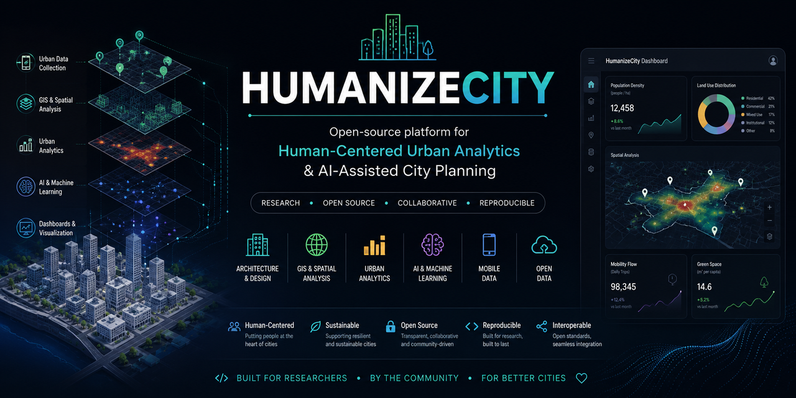

# HumanizeCity

  

<h3 align="center">
Open-source platform for human-centered urban analytics, architectural research, and AI-assisted city planning.
</h3>

**HumanizeCity** is an open-source research platform that helps architects, urban planners, and researchers collect, analyze, and visualize urban data to support evidence-based, human-centered city design.

The project bridges architecture, GIS, urban analytics, and artificial intelligence into a reproducible research workflow.

Its long-term vision is to become an open platform for urban research, spatial analysis, and AI-assisted planning.

## Roadmap

### Near Term
- [ ] Improve documentation
- [ ] Add GIS integration
- [ ] Add urban indicator calculations
- [ ] Add interactive dashboards

### Long Term
- [ ] Public API
- [ ] AI-assisted urban analysis
- [ ] Mobile data collection
- [ ] Open urban datasets
